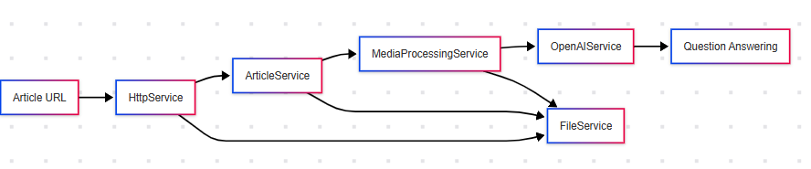

# Zadanie:

Zadanie: Z przechwyconych materiałów interesuje nas tylko jedna z publikacji profesora Maja. Nasza centrala chce pozyskać odpowiedzi na dostarczone przez nią pytania. Zwróć proszę uwagę, że podlinkowana notatka zawiera treści tekstowe, graficzne i dźwiękowe. Istnieje ogromne prawdopodobieństwo, że konieczne będzie wzięcie pod uwagę informacji podanych w każdym formacie. Zadanie, do którego raportujesz odpowiedź nazywa się “ **arxiv** ”.

Link do artykułu: [https://centrala.ag3nts.org/dane/arxiv-draft.html](https://centrala.ag3nts.org/dane/arxiv-draft.html)

Pytania centrali: [https://centrala.ag3nts.org/data/ **KLUCZ-API** /arxiv.txt](https://centrala.ag3nts.org/data/KLUCZ-API/arxiv.txt)

Oczekiwany format odpowiedzi:

```jsx
{
    "ID-pytania-01": "krótka odpowiedź w 1 zdaniu",
    "ID-pytania-02": "krótka odpowiedź w 1 zdaniu",
    "ID-pytania-03": "krótka odpowiedź w 1 zdaniu",
    "ID-pytania-NN": "krótka odpowiedź w 1 zdaniu"
}
```

**Co należy zrobić w zadaniu?**

1. Zaindeksuj (w wybrany przez siebie sposób) cały dokument od profesora Andrzeja Maja. Pisząc CAŁY, mamy na myśli teksty, grafiki, dźwięki.
2. Warto pamiętać o kontekstowości materiałów. Dźwięki i obrazy występują w konkretnym kontekście, który może zmieniać ich odbiór.
3. Korzystając z prostego rozwiązania opartego na modelu LLM, odpowiedz na pytania centrali. W ramach realizacji zadania nie musisz korzystać z typowego RAG z bazą wektorową. Możesz oprzeć swoje rozwiązanie na jednym pliku (np. Markdown), który zawiera wszystkie potrzebne informacje do generowania odpowiedzi.
4. Gdy odpowiedzi na wszystkie pytania centrali będą poprawne, otrzymasz flagę.

# Architektura rozwiazania



# To Consider

## Core Architecture

* Python-based solution with async/await pattern
* Focus on processing multimodal content (text, images, audio)
* Context-aware content processing
* Categoriztion (see copilot answer)

## Key Components

### HttpService (Implemented)

* Fetches article content and questions
* Features:
* Article HTML fetching
* Questions text downloading
* Binary data handling (images, audio)
* Retry mechanism
* Error handling

### FileService (To Implement)

* Manages content storage and retrieval
* Features:
* Save processed content to Markdown
* Cache media analysis results
* Manage temporary files
* Handle file operations
* Content persistence

### ArticleService (To Implement)

* Processes the article content
* Features:
* HTML parsing
* Content structure analysis
* Context preservation
* Media content identification
* Markdown generation

### MediaProcessingService (To Implement)

* Handles multimodal content
* Features:
* Image analysis using OpenAI Vision
* Audio transcription using Whisper
* Context preservation between media types
* Content integration

### OpenAIService (To Implement)

* Generates answers to questions
* Features:
* Question processing
* Context-aware answering
* Response formatting
* Token management

A generic processing service, implementiong other content type processing services?

Pamitaj o kontekstowosci, czyli tekst, audi oraz zdjecia moga nadawac wspolnie jakis kontekst?

## Implementation Steps

1. Fetch article content and questions (HttpService - Done)
2. Parse and structure article content
3. Process images and audio
4. Create unified context
5. Generate answers to questions
6. Format responses
7. Manage content storage
